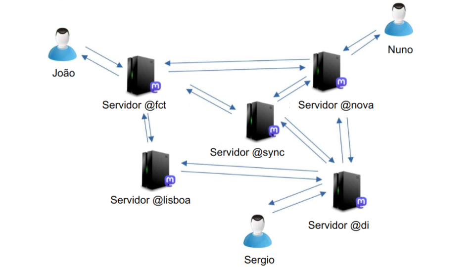

# Sistemas Distribuídos, 2022-23
## Trabalho 1

#### Prazos
* 1º Trabalho - 23 de abril, 23h59, 15 minutos de tolerância (online - código + relatório/formulário)
* Formulário para entrega do trabalho: [https://forms.gle/ofSBFcBFAiQGDyxX8](https://forms.gle/ofSBFcBFAiQGDyxX8)

### Objetivo

O objetivo do trabalho é desenvolver uma rede social 
distribuída semelhante ao Mastodon. 
Nesta rede social, existe um conjunto de domínios (servidores na terminologia
Mastodon).  

Um utilizador terá uma conta num domínio, o que lhe permitirá interagir 
com utilizadores desse e de outros domínios.
Cada domínio faz a gestão dos perfis de utilizadores 
registados nesse domínio. 
Cada utilizador pode alterar a informação do seu perfil e tem um feed de mensagens.
Um utilizador publica novas  mensagens no seu feed e pode obter a mensagem 
do seu feed (ou do feed de outros utilizadores).  
Para além disso o utilizador pode subescrever outros 
utilizadores mesmo que estejam registados noutro domínio - 
o envio de pedidos é efetuado sempre contactando
o servidor do seu Mastodon.


### Arquitetura

O sistema será composto por um conjunto de domínios (equivalente a um servidor Mastodon). 
No primeiro trabalho, cada domínio é composto por um servidor de utilizadores
e um servidor de feeds.
A figura seguinte fornece uma visão global de alto-nível da arquitectura da aplicação (em
que um servidor Mastodon é composto por um servidor de utilizadores e um servidor de feeds).



A gestão de utilizadores será efetuada pelo **serviço Users**, com recurso às seguinte operações:

- criação de um utilizador;
- obtenção da informação associada a um utilizador existente;
- modificar a informação associada a um utilizador;
- remoção de um utilizador.

Cada domínio gere ainda o feed de Mastodon associada a cada um dos seus utilizadores.
O feed de um utilizador tem as mensagens mais recentes deste utilizador bem como as mensagens mais recentes das pessoas que ele subsescreve.

A gestão do feed será efetuada pelo **serviço Feeds**, com recurso às seguintes operações:

- publicar no seu feed - para publicar uma nova mensagem o utilizador deve contactar o
servidor no qual tem a sua conta;
- subscrever ou desubscrever um utilizador;
- obter a lista de utilizadores subscritos;
- listar um feed - onde inclui mensagens do utilizdor e dos utilizadores subscritos;
- obter uma mensagem dum feed.
- apagar uma mensagem do seu feed.

## Interfaces dos serviços

Os servidores dos domínios do sistema serão desenvolvidos por recurso a tecnologia REST (JAX-RS) e
(opcionalmente) através de WebServices SOAP (JAX-WS).

Para garantir a inter-operabilidade com a bateria de testes a disponibilizar,
os serviços terão que ser implementados respeitando interfaces de programação pré-definidas e os
efeitos esperados das suas operações (**incluindo resultados e exceções**).

O código das interface está disponível na seguinte [https://github.com/preguica/sd2223-trab1](https://github.com/preguica/sd2223-trab1).
O código tem documentação de como as operações devem ser invocadas e qual o resultado da sua invocação (incluindo erros a enviar).

O zip contém um projeto Maven, que sugerimos que usem como base para a realização do trabalho.

Nota: As interfaces podem ser modificadas apenas introduzindo novas operações, ou através de parâmetros opcionais nas operações pré-existentes).

Nota: As interfaces definidas, com os pedidos a serem efetuados sobre canais não cifrados, não são seguras. Os aspetos de segurança serão endereçados no segundo trabalho.

## Auto-configuração

Ao ser lançado, um servidor recebe o domínio a que está associado através do primeiro 
argumento do programa (`args[0]`).

O servidor recebe ainda um segundo parâmetro (`args[1]`) que é um número inteiro, diferente para cada servidor.
Este número pode ser usado como base para gerar identificadores únicos para as mensagens, de forma a que
cada mensagem tenha um identificador diferente.

Os servidores deverão ser capazes de se autoconfigurarem, não podendo depender de 
endereços IP fixos.
Para tal, deverão implementar um mecanismo de descoberta baseado em anúncios periódicos 
(por parte dos servidores) e comunicação IP multicast.

Este mecanismo também será o meio utilizado pela bateria de testes para descobrir as instâncias dos servidores
presentes na rede local.

O protocolo de descoberta consiste em enviar periodicamente para o endereço IP multicast e porto pré-acordados, uma mensagem,
contendo uma string, com o seguinte formato:

```
<nome-do-domínio>:<serviço><tab><uri-do-servidor>
```

O `<uri-do-servidor>` deve terminar com /rest ou /soap para indicar, respetivamente, 
que se trata de um servidor REST ou SOAP.
O `<serviço>` pode ser `users` ou `feeds`.

**Nota:** No domínio `nova`, o serviço de utilizadores será lançado na máquina (container)
com nome `users.nova` e o serviço de mensagens será lançado na máquina `feeds.nova`.


## Requisitos da solução

O foco deste primeiro trabalho será centrado nas tecnologias de Invocação Remota na Web e na Distribuição.

A solução não precisa de tolerar falhas de componentes. As únicas falhas a contemplar são as falhas
(temporárias) de comunicação. (Não há, assim, necessidade de introduzir replicação de componentes, nem persistência da
informação mantida.)

A compatibilidade com as interfaces e operações pré-definidas tem que ser observada.
No entanto, poderá ser necessário adicionar mais operações para atender a alguns dos requisitos da solução.


### Requisitos mínimos (max: 8 valores)

- API REST - Servidores versão REST funcionais, com todas as operações a executarem corretamente
com apenas um domínio;
- Auto-configuração - A descoberta por multicast dos servidores funciona corretamente;

**Tests:** 2, 3, 4.

### Requisitos base (max: 13 valores)

- Funcionalidade completa - Servidores REST funcional, com todas as operações a executar 
corretamente entre múltiplos domínios quando as falhas de comunicação não excedem 10 segundos.
- Controlo de concorrência - Os servidores REST funciona corretamente quando vários clientes 
efetuam pedidos concorrentemente.

**Tests:** 5, 6, 7a-c. 

### Elementos valorativos (max: 20 valores)

- Eficiência do sistema (max: 3 valores) - O sistema deve funcionar de forma eficaz na
na execução de operações, mesmo na presença de falha de comunicação entre domínios
superiores a 10 segundos. Sugestão: considere a propagação assíncrona de operações.
**Tests:** 7d-f.

- WebServices Soap (max: 3 valores) - O sistema funciona com servidores SOAP apenas;
**Tests:** 9, 10, 11.

- WebServices Soap interoperáveis (max: 5 valores; alternativa a WebServices Soap) - O sistema funciona com
servidores REST e SOAP no mesmo sistema;
**Tests:** 12.

Nota: Os elementos valorativos não serão considerados em pleno caso os requisitos base não sejam atingidos de forma satisfatória.
Não é necessário realizar todos os elementos valorativos para atingir a cotação máxima.

### Fatores depreciativos

O código entregue deverá seguir boas práticas de programação. A repetição desnecessária de 
código, inclusão de constantes mágicas, o uso de estruturas de dados inadequadas, etc., 
poderá incorrer numa penalização.
(max: 2 valores)

Falta de robustez e comportamentos erráticos da solução são motivo para penalização. 
(max: variável)

A solução deve contemplar as falhas temporárias dos canais de comunicação.

## Notas sobre (in)segurança

As interfaces definidas, com os pedidos a serem efetuados sobre canais não cifrados, não são seguras.

Os aspetos de segurança serão completados no segundo trabalho.

## Execução
O trabalho pode ser realizado em grupo de 1 ou 2 alunos.
Os alunos do mesmo grupo não precisam de pertencer ao mesmo turno prático, embora tal 
seja fortemente recomendado.

## Avaliação
A avaliação do trabalho terá em conta os seguintes critérios:

- Funcionalidades desenvolvidas e a sua conformidade com a especificação, 
tendo como base os resultados
da bateria de testes automáticos;
- Qualidade da solução;
- Qualidade do código desenvolvido.

A classificação final do aluno é individual e será menor ou igual à classificação do 
trabalho, em função dos resultados obtidos na discussão do trabalho (caso ocorra).


## Bateria de testes

A bateria de testes destinada a verificar a conformidade da solução com a especificação 
está disponível em [Tester](tester).

De notar que passar os testes não garante que o trabalho está correto, dado que 
não se podem testar todas as situações.

# Ambiente de desenvolvimento

Todo o material de apoio fornecido pressupõe que o desenvolvimento será em ambiente Linux e Java 17.
A validação do trabalho por via da bateria de testes automática fará uso de tecnologia Docker.

# FAQ

1. Os identificadores das mensagens devem ser criados no servidor de mensagens.

1. A operação **removeFromPersonalFeed** remove uma mensagem do feed de um utilizador. 
Fica ao critérios dos alunos se: (a) a remoção apenas pode ser efetuada pelo utilizador que 
criou a mensagem - neste caso, a mensagem deve ser removida de todos os feeds em que esteja presente; 
(b) cada utilziador pode remover qualquer operação do seu feed - neste caso, a remoção não tem efeitos
nos feeds de outros utilizadores.

1. Fica ao critério dos alunos o que deve acontecer quando um utilziador deixa de subscrever outro
utilizador - neste caso, as mensagens podem ser removidas ou manterem-se no feed.

1. O campo `creationTime` na [Message](https://github.com/preguica/sd2223-trab1/blob/main/src/sd2223/trab1/api/Message.java) deve ser inicializado pelo servidor que recebe a publicação do cliente (autor).

# Histórico de alterações

4-Abr: adicionada informação sobre o 2º parâmetro no arranque dos servidores.

15-Mar: versão 0.1
