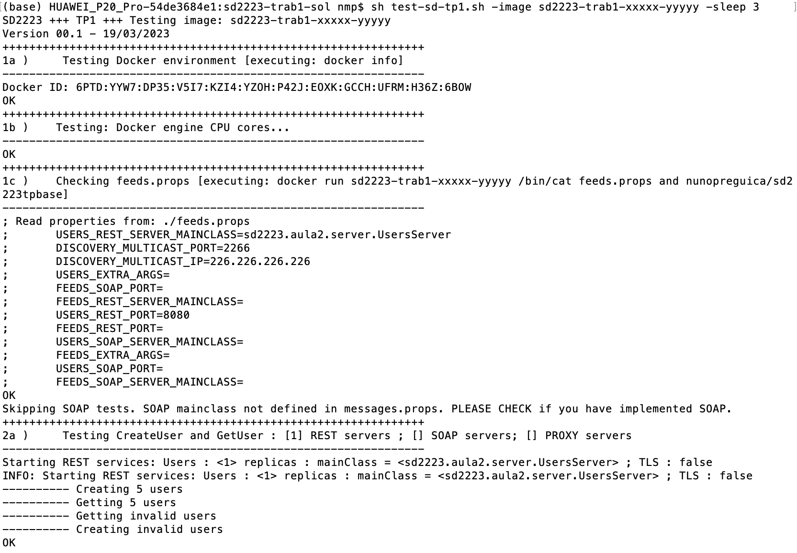
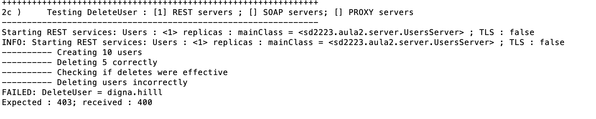
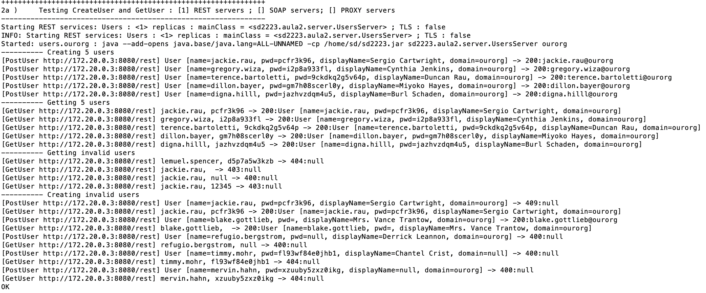

## Trabalho 1 - *Tester*

O *Tester* tem como objetivo permitir o teste do trabalho prático 1, de forma sistemática e uniforme para todos os grupos.
Os alunos poderão testar a correção da sua implementação, usando o *Tester*.

Para executar o tester, os alunos com sistemas operativos Linux ou MacOS devem usar o script 
[test-sd-tp1.sh](https://github.com/preguica/sd2223-trab1/raw/main/test-sd-tp1.sh),
enquanto que os alunos com Windows 10 devem usar o script [test-sd-tp1.bat](https://github.com/preguica/sd2223-trab1/raw/main/test-sd-tp1.bat).

**Nota**: Todos os ficheiros mencionados estão dispopíveis em:
[https://github.com/preguica/sd2223-trab1](https://github.com/preguica/sd2223-trab1).
 
### Preparação
Antes de executar o tester e criar a imagem docker, devem adicionar e atualizar o 
fichero [feeds.props](https://github.com/preguica/sd2223-trab1/raw/main/feeds.props) 
na raiz do vosso projeto com a informação correta:


```
USERS_REST_SERVER_MAINCLASS=classe do servidor Users REST (e.g. sd2223.tp1.server.RESTUsersServer)
USERS_REST_PORT=porto do servidor Users REST (e.g. 8080)
USERS_SOAP_SERVER_MAINCLASS=classe do servidor Users SOAP (e.g. sd2223.tp1.server.SOAPUsersServer)
USERS_SOAP_PORT=porto do servidor Users SOAP (e.g. 8080)
USERS_EXTRA_ARGS=parâmetro adicional a passar ao servidor Users, se algum
FEEDS_REST_SERVER_MAINCLASS=classe do servidor Feeds REST (e.g. sd2223.tp1.server.RESTFeedsServer)
FEEDS_REST_PORT=porto do servidor Feeds REST (e.g. 8080)
FEEDS_SOAP_SERVER_MAINCLASS=classe do servidor Feeds SOAP (e.g. sd2223.tp1.server.SOAPFeedsServer)
FEEDS_SOAP_PORT=porto do servidor Feeds SOAP (e.g. 8080)
FEEDS_EXTRA_ARGS=parâmetro adicional a passar ao servidor Feeds, se algum
DISCOVERY_MULTICAST_IP=endereço multicast para descoberta (e.g. 226.226.226.226)
DISCOVERY_MULTICAST_PORT=porto para descoberta (e.g. 2266)
```

Enquanto não tiverem a parte SOAP implementada, devem deixar as propriedades respetivas sem nenhum valor, mas não as devem apagar.
Podem igualmente testar o servidor Users sem terem o servidor Feeds funcional, deixando a respetiva propriedade sem
nenhum valor.

Devem usar o ficheiro **Dockerfile** presente no repositório das interfaces,
 presente no seguinte link: [Dockerfile](https://github.com/preguica/sd2223-trab1/raw/main/Dockerfile).

**Sempre que alteram o vosso trabalho (incluindo o ficheiro feeds.props)** devem criar 
uma nova imagem Docker do vosso trabalho (usando o projeto Maven disponibilizado, 
tal consiste em executar: `mvn clean compile assembly:single docker:build`).

### Execução dos testes

Para executar o *Tester*, basta executar o seguinte comando, 
usando o nome da imagem do vosso trabalho (**substituir sd2223-trab1-xxxxx-yyyyy pelo 
nome da vossa imagem**):

```
Linux / MacOS
sh test-sd-tp1.sh -image sd2223-trab1-xxxxx-yyyyy
```
```
Windows
test-sd-tp1.bat -image sd2223-trab1-xxxxx-yyyyy
```
*NOTA:* há uma secção sobre problemas com a execução deste comando mais tarde neste documento.

O *Tester*, ao executar, corre uma série de passos, indicando genericamente 
as verificações que está a efetuar. 
Caso os testes de cada fase corram corretamente, no fim de cada fase 
aparece a mensagem OK. 

Exemplo de uma execução correta (truncada):



Caso um teste falhe, apresenta informação de qual o erro que ocorreu, indicando o resultado recebido do vosso trabalho e qual o resultado esperado. Adicionalmente, serão apresentadas as menssagens escritas pelo vosso programa para o output.

Exemplo de uma execução com um erro (em que se pode ver que se esperaria o código 403 e se recebeu o código 404 na execução dum DeleteUser):




### Outras opções do *Tester*

O *Tester* possui algumas opções que podem ser especificadas ao corrê-lo, que modificam o seu comportamento.

* **-test \<num\>** : Permite omitir a execução de alguns testes. 
Por exemplo, se passarem o valor **-test 2b**, os testes começarão no 
teste 2b. Esta opção é útil quando já verificaram que o vosso trabalho 
funciona corretamente até um dado teste e estão a corrigir erros num 
teste específico.
  
* **-sleep \<seconds\>** : Permite diminuir o tempo de espera entre serem 
lançadas os containers com o vosso trabalho e iniciar a execução dos 
testes. Podem ajustar este valor consoante a capacidade do vosso 
computador e as operações que estejam a fazer na fase de inicialização.

* **-log OFF\|ALL\|FINE\|FINEST** : Permite controlar o nível de mensagens 
gerado pelo programa. Por exemplo, ao usarem a opção **-log FINE**, o 
programa vai indicar todas as operações que está a fazer ao vosso sistema, 
indicando as mensagens recebidas e as esperadas, como se apresenta na 
imagem seguinte:

* **-textsize \<len\>** : Permite indicar a dimensão máxoma do texto das 
mensagens criadas.




### Problemas com o script

Dicas sobre execução no Windows a adicionar brevemente, no entanto se não conseguirem usar o script fornecido num terminal, podem executar o Tester manualmente com o seguinte conjunto de comandos:

Para criar a rede -- a executar uma vez, ou quando a rede *sdnet* tiver sido removida (por exemplo pelo docker system prune):
```
docker network create -d bridge sdnet 
```

Para atualizar a imagem -- a executar sempre que o *Tester* for atualizado:
```
docker pull nunopreguica/sd2223-tester-tp1
```

Para executar o *Tester* (notem que podem ter de fazer scroll na linha abaixo):
```
docker run --rm --network=sdnet -it -v /var/run/docker.sock:/var/run/docker.sock nunopreguica/sd2223-tester-tp1:latest -image sd2122-trab1-xxxxx-yyyyy
```

Quem tenha problemas a correr o *Tester*, deve 
fazer um post no [Discord](https://discord.com/channels/1085739486492753981/1085739993248583790), 
com a seguinte informação: dump da mensagem de erro, sistema de operação e versão do 
docker que estão a usar. 
Caso já exista uma mensagem semelhante, façam reply a essa mensagem.

### Códigos de erro

Os códigos de erro que os vossos servidores devolvem devem estar de acordo
com os comentários das respetivas interfaces, disponíveis em: [https://github.com/preguica/sd2223-trab1](https://github.com/preguica/sd2223-trab1).

### Versões

As versões do *Tester* são incrementais, i.e., a versão N do *Tester* executará todos os testes das versões anteriores.
Nesta secção indicam-se as funcionalidades testadas por cada versão.

#### Versão 1
Testa as seguintes funcionalidades (REST):
* criação e leitura de utilizadores (2a)
* atualização de utilizadores (2b)
* remoção de utilizadores (2c)

#### Versão 2
Testa as seguintes funcionalidades (REST):
* pesquisa de utilizadores (2d)

Testa as seguintes funcionalidades em apenas um domínio (REST):
* criação de mensagens, leitura de mensagens e feeds (3a)
* mix sem remoção de mensagens (3b)
* mix com remoção de mensagens (3c)

Testa as seguintes funcionalidades em múltipls domínios (REST):
* criação de mensagens, leitura de mensagens e feeds (5a)
* mix sem remoção de mensagens (5b)
* mix com remoção de mensagens (5c)

#### Versão 3
Testa as seguintes funcionalidades em apenas um domínio (REST):
* mix com remoção de utilizadores (3d)
* mix com getMessage com time diferente de 0 (3e)
* mix com getMessage* que necessitam de forward (3f)

Testa as seguintes funcionalidades em dois domínios (REST):
* mecanismo de anúncios (4a)
* mix com remoção de utilizadores (5d)
* mix com getMessage com time diferente de 0 (5e)
* mix com getMessage* que necessitam de forward (5f)

Testa as seguintes funcionalidades em apenas um domínio (REST):
* Operações concorrentes no servidor de utilizadores (6a)
* Operações concorrentes no servidor de feeds (6b)
* Operações concorrentes em ambos os servidores (6c)

#### Versão 4
Testa as seguintes funcionalidades (SOAP):
* criação e leitura de utilizadores (8a)
* remoção de utilizadores (8b)
* pesquisa de utilizadores (8c)

#### Versão 5
Testa as seguintes funcionalidades em apenas um domínio (REST):
* Verifica se mecanismo de simulação de falhas de comunicação está funciona (7a)\
**NOTA:** Se este teste falhar, o resultado dos testes de falhas não terá significado. 
* Operações no servidor de feeds, com falha temporária para o servidor de users (7b)
* Operações no servidor de user, com falha temporária para o servidor de feeds (7c)

Testa as seguintes funcionalidades com dois domínios (REST):
* Operações no servidor de feeds, com falha temporária para o servidor de feeds para outro domínio (7d)
* Operações no servidor de feeds, com falha longa para o servidor de feeds para outro domínio (7e)
* Operações no servidor de feeds, com falha longa para o servidor de feeds para dois outros domínios (7f)
 
Testa as seguintes funcionalidades em apenas um domínio (SOAP):
* criação de mensagens, leitura de mensagens e feeds (9a)
* mix sem remoção de mensagens (9b)
* mix com remoção de mensagens (9c)
* mix com remoção de utilizadores (9d)
* mix com getMessage* que necessitam de forward (9e)

Testa as seguintes funcionalidades em dois domínios (SOAP):
* criação de mensagens, leitura de mensagens e feeds (10a)
* mix com remoção de mensagens (10b)
* mix com remoção de utilizadores (10c)

Testa as seguintes funcionalidades em apenas um domínio (SOAP):
* Operações no servidor de feeds, com falha temporária para o servidor de users (11a)
* Operações no servidor de user, com falha temporária para o servidor de feeds (11b)

Testa as seguintes funcionalidades com dois domínios (SOAP):
* Operações no servidor de feeds, com falha temporária para o servidor de feeds para outro domínio (11c)
* Operações no servidor de feeds, com falha longa para o servidor de feeds para outro domínio (11d)

Testa as seguintes funcionalidades com múltiplos domínios (REST + SOAP):
* criação de mensagens, leitura de mensagens e feeds, 2 domínios (12a)
* mix com remoção de mensagens, 2 domínios (12b)
* mix com remoção de utilizadores, 2 domínios (12c)
* mix com remoção de mensagens, 3 domínios (12d)
* mix com remoção de mensagens, 2 domínios heterogéneos (12e)


### Notas finais

O facto dum trabalho passar os testes todos (ou o teste duma funcionalidade) não equivale a que tenha a cotação máxima. 
Primeiro, devem ter em atenção que os testes apenas estão a testar as funcionalidades indicadas na listagem anterior.
Segundo, a avaliação do trabalho terá em conta a qualidade do código.
